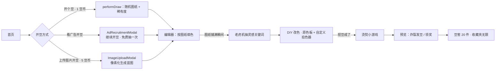

<div align="center">


# 我勒个豆（Whatsdot）

**开豆券 · 拼豆画 · 像素风盲盒小游戏**

[在 Google AI Studio 中打开](https://ai.studio/apps/4e687ed5-1ca4-4ef2-aa81-56e559310ab4)

</div>

---

## 目录

- [项目简介](#项目简介)
- [核心玩法与流程](#核心玩法与流程)
- [功能特性](#功能特性)
- [技术栈](#技术栈)
- [仓库结构](#仓库结构)
- [本地开发](#本地开发)
- [环境变量](#环境变量)
- [抖音小游戏环境](#抖音小游戏环境)
- [Firebase 与全局播报](#firebase-与全局播报)
- [上传图片 → 像素图](#上传图片--像素图)
- [豆币体系](#豆币体系)
- [数据与隐私（本地存储）](#数据与隐私本地存储)
- [A/B 实验与埋点](#ab-实验与埋点)
- [构建与部署](#构建与部署)
- [常见问题](#常见问题)
- [相关链接](#相关链接)

---

## 项目简介

「我勒个豆」是一款面向 **H5 / 抖音小游戏** 的轻量级像素拼豆体验：玩家消耗 **豆币** 抽取随机稀有度的 **图纸（Blueprint）**，在编辑器中按格填色、触发老虎机抽灵感关键词、进入 **DIY 自由创作**（可用内置色或拾色器新增自定义色），再过 **烫熨** 小游戏，最后在 **预览 / 豆窖 / 收藏夹** 中留存。也可**上传自己的图片**经浏览器端像素化后当蓝图玩。  
项目在浏览器中可完整运行（含广告、登录等能力的 **模拟实现**），便于开发与调试。

应用元信息见根目录 [`metadata.json`](metadata.json)。

---

## 核心玩法与流程



1. **首页**：三种开豆入口并列——
   - 「开个豆！」 `1 豆币`（主）
   - 「看广告开豆」（广告商未入驻时弹占位弹窗，点「继续开豆」直接免费抽一次）
   - 「上传图片开豆」 `5 豆币`
   每日首次进入自动发放 **豆币 +1**。
2. **抽卡 / 上传生成蓝图**：随机蓝图走权重档位；上传走 LAB k-means 量化（[src/lib/pixelate.ts](src/lib/pixelate.ts)）。`variant` 组还有欧气值保底与幸运暴击。
3. **编辑器**：按图纸连通区域填色；铺满后 **老虎机摇一摇** 从 20 个关键词里抽一个（[src/components/SlotMachine.tsx](src/components/SlotMachine.tsx)），然后进入 **DIY 改色 + 自定义拾色器** 阶段，可单格改色并追加任意 HSL 色。
4. **烫熨**：带**拖动提示**（手指图标演示按住拖动），支持毛巾 / 镜面两种烫法 + 温度校准。
5. **预览 → 豆窖 / 收藏夹**：作品存 localStorage；豆窖保留最近 20 件（按时间）；爱心按钮加入 / 移出 **收藏夹**（[src/components/CollectionRoom.tsx](src/components/CollectionRoom.tsx)）。作品详情内可**花 1 豆币重命名**。
6. **豆币管理页**：点击 header 豆币胶囊进入（[src/components/CoinManage.tsx](src/components/CoinManage.tsx)），余额 + 获得 / 消耗说明 + 调试 +10 入口。

---

## 功能特性

| 模块 | 说明 |
|------|------|
| **抽卡与稀有度** | 6 档稀有度（绿 / 蓝 / 紫 / 金 / 红 / 史诗），不同档位对应不同 **网格尺寸**（[src/types.ts](src/types.ts) 的 `RARITY_CONFIG`）。 |
| **图纸数据** | 16 个 IP × 5 档 + 1 个史诗皮肤；算法放大 8×8 底稿 → 12/24/32。见 [src/constants/blueprints.ts](src/constants/blueprints.ts)、[ipPixelTemplates.ts](src/constants/ipPixelTemplates.ts)、[kuromiPastelGrid.ts](src/constants/kuromiPastelGrid.ts)。 |
| **豆币经济** | 单一货币（原「开豆券 + 豆币」已合并）：抽卡 1、重命名 1、上传图片 5。看广告走独立弹窗，广告商未入驻时可免费抽一次。旧档的 `tokens` 在 `loadProfile` 里自动迁移进 `coins`。常量见 [types.ts](src/types.ts) 的 `COIN_*_COST`。 |
| **老虎机关键词** | 20 词池（[src/constants/slotKeywords.ts](src/constants/slotKeywords.ts)）：谷雨、工位、镜子、未寄出、山海、红豆、同桌、跑步、公路旅行、猫、深夜食堂、树洞、召唤师、逆风如解意、马、王、七里香、三分糖、第二杯半价、Hackathon。 |
| **DIY 扩展色板** | 原色板 + 「+」按钮调用原生 `<input type="color">` 追加自定义色；自定义色随作品持久化到 `paletteColors`，后续所有展示路径（PixelWorkLayer、Preview、Vault、WorkDetailModal、CollectionRoom）统一用 `work.paletteColors ?? blueprint.colors` 渲染。 |
| **上传图片 → 蓝图** | 浏览器端移植自 [tools/pixelate.py](tools/pixelate.py)：中心裁方 → 饱和增强 → 降采样 → LAB 空间 k-means++（种子固定可复现）→ 按亮度排序。网格 16/24/32/48/60/72，色号 6–20，实时预览，200ms debounce。生成的蓝图 id 前缀 `upload_`，存在 `whatsdot_custom_blueprints` 里，`findBlueprintById` 优先命中。 |
| **收藏 / 重命名** | 作品的 `favorite` / `customName` 字段；豆窖按时间展示最近 20 件，收藏夹只展示 `favorite === true`。详情弹窗内笔尖按钮扣 1 豆币改名。 |
| **3D 详情预览** | WorkDetailModal 作品 3D 预览支持**旋转 / 静止**两档切换；静止状态下按住拖动仍可自由旋转。 |
| **增强组（variant）** | A/B 分流：欧气进度、幸运暴击、顶部 **全服播报**（Firestore）、世界频道跑马灯。 |
| **抖音适配** | `DouyinService` 统一封装 `tt` API 与浏览器 Mock（登录、激励视频、Toast、Modal、发抖音等）。 |
| **埋点** | 关键行为写入 `localStorage` 事件队列（[src/lib/analytics.ts](src/lib/analytics.ts)），含会话与留存相关生命周期（[src/lib/lifecycle.ts](src/lib/lifecycle.ts)）。 |

---

## 技术栈

| 类别 | 选型 |
|------|------|
| 框架 | [React 19](https://react.dev/) |
| 语言 | [TypeScript](https://www.typescriptlang.org/) |
| 构建工具 | [Vite 6](https://vitejs.dev/) |
| 样式 | [Tailwind CSS 4](https://tailwindcss.com/) + `@tailwindcss/vite` |
| 动效 | [Motion](https://motion.dev/)（`motion/react`） |
| 图标 | [lucide-react](https://lucide.dev/) |
| 工具库 | `clsx`、`tailwind-merge`、`date-fns` |
| 后端 / 同步 | [Firebase](https://firebase.google.com/)（Firestore，用于可选的全局播报） |
| 运行时配置 | `dotenv`（与模板/构建链路兼容） |

路径别名：`@/*` 指向仓库根目录（见 `tsconfig.json` 与 `vite.config.ts`）。

---

## 仓库结构

```
Whatsdot2.0/
├── src/
│   ├── App.tsx                 # 根状态、视图路由、豆币消费、各 handler
│   ├── main.tsx                # 入口
│   ├── types.ts                # 用户 / 图纸 / 作品类型 + COIN_*_COST 常量
│   ├── components/
│   │   ├── Home.tsx                  # 三按钮首页（开豆 / 看广告 / 上传）
│   │   ├── Header.tsx                # 顶栏 + 可点豆币胶囊
│   │   ├── CoinManage.tsx            # 豆币管理页（余额 + 获得 / 消耗 + 调试）
│   │   ├── Editor.tsx                # 编辑器 + 老虎机触发 + DIY 自定义色板
│   │   ├── SlotMachine.tsx           # 铺满后灵感关键词滚动弹窗
│   │   ├── Ironing.tsx               # 烫熨小游戏 + 拖动手指提示
│   │   ├── Preview.tsx               # 预览 / 延时回顾 / 分享
│   │   ├── Vault.tsx                 # 豆窖（最近 20 件，爱心加收藏）
│   │   ├── CollectionRoom.tsx        # 收藏夹（favorite === true）
│   │   ├── WorkDetailModal.tsx       # 3D 作品详情 + 旋转/静止 + 重命名
│   │   ├── ImageUploadModal.tsx      # 上传图片 → 像素化 → 5 豆币生成蓝图
│   │   ├── AdRecruitmentModal.tsx    # 广告位招募占位弹窗 + 继续开豆
│   │   ├── DrawModal / DrawEffects   # 开盒动画
│   │   ├── AnnouncementTicker.tsx    # 全服播报（enhanced 组）
│   │   └── WorldChannel.tsx          # 世界频道跑马灯
│   ├── constants/
│   │   ├── blueprints.ts             # 16 IP × 5 档 + epic kuromi_pastel
│   │   ├── ipPixelTemplates.ts       # 每 IP 的 8×8 底稿
│   │   ├── kuromiPastelGrid.ts       # 手绘 32×32 史诗皮肤
│   │   └── slotKeywords.ts           # 老虎机 20 词池
│   ├── lib/
│   │   ├── localGuest.ts             # localStorage 封装（profile / works / 自定义蓝图）
│   │   ├── pixelate.ts               # 浏览器端像素化（canvas + LAB k-means）
│   │   ├── utils.ts                  # cn / formatDate / getWorkPalette
│   │   ├── ab.ts / analytics.ts / lifecycle.ts / perf.ts
│   └── services/                     # 抖音适配、Firestore 播报
├── tools/
│   ├── pixelate.py             # 离线参考脚本（对齐 src/lib/pixelate.ts）
│   └── README.md
├── firebase-applet-config.json # Firebase 前端配置（按需替换为你自己的项目）
├── firebase-blueprint.json     # 与 Firebase/蓝图相关的辅助配置（若使用）
├── vercel.json                 # SPA 重写，部署到 Vercel 等静态托管
├── vite.config.ts
├── tsconfig.json
├── package.json
├── metadata.json               # 应用名称与描述（对外展示）
└── README.md
```

---

## 本地开发

### 环境要求

- **Node.js**：建议 **20 LTS** 或当前维护版本（需支持 Vite 6 与项目所用语法）。
- 包管理器：使用 **npm**（仓库含 `package-lock.json`）。

### 安装与启动

```bash
npm install
npm run dev
```

默认开发服务器：**端口 3001**，监听 `0.0.0.0`（见 `package.json` 中 `dev` 脚本），便于局域网设备或容器访问。

其他命令：

| 命令 | 作用 |
|------|------|
| `npm run build` | 生产构建，输出到 `dist/` |
| `npm run preview` | 本地预览构建产物 |
| `npm run lint` | 运行 `tsc --noEmit` 做类型检查 |
| `npm run clean` | 删除 `dist`（Unix 风格 `rm -rf`；Windows 若失败可手动删目录） |

### 可选：`GEMINI_API_KEY`

模板在 `vite.config.ts` 中将 `process.env.GEMINI_API_KEY` 注入构建。若你后续在代码中接入 Google Gemini 等能力，可在仓库根目录创建 **`.env.local`**（勿提交密钥）：

```env
GEMINI_API_KEY=你的密钥
```

当前业务代码 **未强制依赖** 该变量；未配置时一般为空字符串，不影响本地跑通主流程。

---

## 环境变量

在 Vite 中，**暴露给前端** 的变量需使用 `VITE_` 前缀（若你在代码中通过 `import.meta.env.VITE_*` 读取）。

| 变量 | 说明 |
|------|------|
| `VITE_ENABLE_GLOBAL_ANNOUNCEMENTS` | 设为 `true` 时启用 Firestore **全局播报**（写入/订阅 `announcements` 集合）。见 `src/services/announcements.ts`。 |
| `GEMINI_API_KEY` | 由 `vite.config.ts` 注入为 `process.env.GEMINI_API_KEY`，供可选的 AI 能力使用。 |
| `DISABLE_HMR` | 设为 `true` 时关闭 Vite HMR（AI Studio 等场景可减少自动刷新干扰）。 |

构建前请将 Firebase 等项目配置为你自己的资源，避免与示例项目混用。

---

## 抖音小游戏环境

`src/services/douyin.ts` 中的 **`DouyinService`** 会检测全局 `tt`：

- **在抖音客户端内**：调用真实 `tt.login`、`tt.createRewardedVideoAd`、`tt.showToast` 等（激励视频需将 `adUnitId` 替换为你在平台申请的单元 ID）。  
- **在普通浏览器**：使用 **Promise + 延时** 等模拟行为，便于本地调试。

若你发布到抖音开放平台，请同时查阅官方文档配置 **域名白名单、安全域名、广告位 ID** 等。

---

## Firebase 与全局播报

启用 `VITE_ENABLE_GLOBAL_ANNOUNCEMENTS=true` 后：

- 使用 `firebase-applet-config.json` 初始化 Firebase 与 **Firestore**（含 `firestoreDatabaseId` 字段以匹配多数据库实例）。  
- 抽中金/红等高品质结果时，会向 `announcements` 集合 **写入一条记录**（增强组且发布成功时），客户端订阅最新若干条并在顶部 **AnnouncementTicker** 展示。

未启用或未配置 Firebase 时，相关逻辑会 **静默跳过** 或仅使用本地合并列表，不影响单机游玩。

---

## 上传图片 → 像素图

从「首页 · 上传图片开豆」进入 [ImageUploadModal](src/components/ImageUploadModal.tsx)：

1. 选本地图片（支持 JPG / PNG；带 alpha 的 PNG 背景会自动留白）
2. 调整 **网格大小**（16 / 24 / 32 / 48 / 60 / 72）、**色号数**（6–20）、**饱和度**（0.8–1.8）
3. 预览 canvas 实时生成（200ms debounce + `requestIdleCallback`，不卡主线程）
4. 输入作品名 → 点「用 5 豆币开始捏豆」扣币 + 蓝图持久化 + 进入编辑器

算法参照 [tools/pixelate.py](tools/pixelate.py) 的 Python 脚本，浏览器版在 [src/lib/pixelate.ts](src/lib/pixelate.ts)：

- 中心裁方 → 饱和增强（luma + lerp）
- 下采样到目标网格（canvas `drawImage` + `imageSmoothingQuality='high'`）
- Alpha 阈值挑出前景像素
- **LAB 空间 k-means++**（种子固定、最多 50 轮）
- 按 R+G+B（≈亮度）升序排序，`colors[0]` 固定白色背景

生成的蓝图 id 前缀 `upload_`，走 `saveCustomBlueprint` 存入 `whatsdot_custom_blueprints`。`findBlueprintById` 优先命中本地自定义蓝图，所以刷新后豆窖 / 收藏夹照常渲染。

> Python 脚本依赖 `numpy`、`Pillow`（可选 `rembg` 做自动抠图）；浏览器版没有 `rembg` 等价物，若要抠图请提前处理好 PNG。

---

## 豆币体系

所有游戏内的**消费 / 奖励**都走单一货币 `coins`（常量在 [src/types.ts](src/types.ts)）：

| 行为 | 成本 / 奖励 | 常量 |
|------|------|------|
| 开个豆（抽卡） | -1 | `COIN_DRAW_COST` |
| 上传图片生成蓝图 | -5 | `COIN_UPLOAD_COST` |
| 重命名作品 | -1 | `COIN_RENAME_COST` |
| 每日首次进入 | +1 | — |
| 欧气暴击（enhanced） | +1 或 +2 | `LuckyCritReward.kind === 'coins'` |
| 预览分享成功 | +1 | — |

入口：点击 header 豆币胶囊进入 [CoinManage.tsx](src/components/CoinManage.tsx)：

- 顶部橙金卡片显示当前余额
- 「获得豆币」列出签到状态、看广告、分享、**调试 +10**（广告商入驻前兜底）
- 「消耗去向」列清所有消费点与单价
- 底部返回首页

---

## 数据与隐私（本地存储）

**没有后端数据库**。所有用户状态存在浏览器 `localStorage`，6 个 key 前缀 `whatsdot_`：

| Key | 用途 | 定义位置 |
|------|------|------|
| `whatsdot_guest_id` | 匿名 UUID | [localGuest.ts](src/lib/localGuest.ts) |
| `whatsdot_profile` | `UserProfile`：**`coins`**、签到日期、欧气值、称号过期、perfTier 等 | [localGuest.ts](src/lib/localGuest.ts) |
| `whatsdot_works` | `CompletedWork[]`：像素数据、`customName`、`favorite`、`paletteColors`、`keyword` 等 | [localGuest.ts](src/lib/localGuest.ts) |
| `whatsdot_custom_blueprints` | 上传图片生成的蓝图（id 前缀 `upload_`，最多保留 50 条） | [localGuest.ts](src/lib/localGuest.ts) |
| `whatsdot_ab` | A/B 分组缓存 | [ab.ts](src/lib/ab.ts) |
| `whatsdot_lifecycle` | 次留 / 七留生命周期标记 | [lifecycle.ts](src/lib/lifecycle.ts) |
| `whatsdot_events` | 环形缓冲的埋点事件 | [analytics.ts](src/lib/analytics.ts) |

**一次性迁移**：老版本用 `tokens` 字段存开豆券；新版合并为单一 `coins` 后，`loadProfile` 会把 `tokens` 累加进 `coins` 并丢弃该字段，不会丢进度。

**注意**：清理站点数据会导致进度丢失。生产环境若需账号级云存档，需自行接入登录与后端同步。

唯一触达远端的是 **全服播报**（Firestore，可选，默认关）：`VITE_ENABLE_GLOBAL_ANNOUNCEMENTS=true` 时写入 `announcements` 集合。

---

## A/B 实验与埋点

- **实验**：`getVariant('loot_vfx_v1', guestId)`（`src/lib/ab.ts`）将用户稳定划分到 `control` 或 `variant`。`variant` 组开启 **增强抽卡体验**（保底、暴击、播报等，与 `App.tsx` 中 `enableEnhanced` 联动）。  
- **埋点**：`track(...)` 将事件写入本地；**生命周期** `initLifecycleTracking` 会触发会话、次日/七日等留存相关事件名（便于后续对接真实上报 SDK）。

---

## 构建与部署

1. 执行 `npm run build` 生成 `dist/`。  
2. 将 `dist` 部署到任意 **静态资源托管**（如 Vercel、Netlify、对象存储 + CDN）。  
3. 仓库中 `vercel.json` 配置了 SPA 重写：所有路径回退到 `index.html`，支持前端路由与刷新。

`.vercelignore` 已排除 `node_modules`、`dist` 等，避免不必要上传。

---

## 常见问题

**Q：豆币不够怎么办？**  
A：① 每日首次进入自动 +1；② 点击 header 豆币胶囊进入 **豆币管理页**，里面有「调试 · 手动 +10」按钮（开发阶段兜底，广告商未入驻前临时开放）；③ 主按钮下的「看广告开豆」会弹占位弹窗，点「继续开豆」也能免费抽一次。

**Q：上传图片生成的蓝图刷新后没了？**  
A：应该还在。`findBlueprintById` 会优先读 `whatsdot_custom_blueprints`（最多保留 50 条），如果豆窖显示不出来，检查浏览器是否清过站点数据，或者看 DevTools → Application → Local Storage 里该 key 是否被清空。

**Q：老版本的开豆券去哪了？**  
A：自动合并进豆币。`loadProfile` 检测到旧字段 `tokens` 会一次性累加到 `coins` 然后丢弃，进度不丢。

**Q：上传了自定义色，烫熨 / 预览显示不对？**  
A：所有渲染路径都用 `work.paletteColors ?? blueprint.colors`，自定义色随作品一起持久化。若遇到异常，通常是旧作品没有 `paletteColors` 字段——重新生成即可。

**Q：为什么看不到顶部全服播报？**  
A：需要同时满足：① A/B 为 **variant**；② 环境变量开启 `VITE_ENABLE_GLOBAL_ANNOUNCEMENTS`；③ Firebase 配置有效且网络允许访问 Firestore。

**Q：类型报错 / 构建失败？**  
A：运行 `npm run lint` 查看 TypeScript 错误。仓库本身留有两个已知 hint（`vault_delete_work` 事件名未在 `EventName` 枚举里 + `@/assets/logo.png` 缺声明），非本次改动造成，不影响运行。

**Q：`npm run clean` 在 Windows 上报错？**  
A：脚本使用 `rm -rf`，在 Git Bash 或 WSL 下执行，或手动删除 `dist` 文件夹。

---

## 相关链接

- [Google AI Studio 应用](https://ai.studio/apps/4e687ed5-1ca4-4ef2-aa81-56e559310ab4)  
- [Vite 文档](https://vitejs.dev/)  
- [React 文档](https://react.dev/)  
- [Tailwind CSS](https://tailwindcss.com/)  
- [抖音开放平台 / 小游戏文档](https://developer.open-douyin.com/)（发布与审核以官方为准）

---

## 许可证

若仓库根目录未包含 `LICENSE` 文件，使用前请与项目维护者确认授权范围；第三方素材与 IP 相关图纸请遵守相应版权与授权协议。
