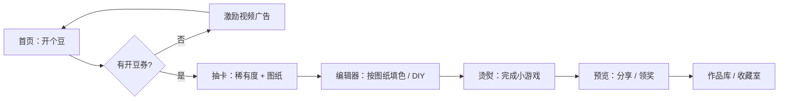

<div align="center">


# 我勒个豆（Whatsdot）

**开豆券 · 拼豆画 · 像素风盲盒小游戏**

[在 Google AI Studio 中打开](https://ai.studio/apps/4e687ed5-1ca4-4ef2-aa81-56e559310ab4)

</div>

---

## 目录

- [项目简介](#项目简介)
- [核心玩法与流程](#核心玩法与流程)
- [功能特性](#功能特性)
- [技术栈](#技术栈)
- [仓库结构](#仓库结构)
- [本地开发](#本地开发)
- [环境变量](#环境变量)
- [抖音小游戏环境](#抖音小游戏环境)
- [Firebase 与全局播报](#firebase-与全局播报)
- [数据与隐私（本地存储）](#数据与隐私本地存储)
- [A/B 实验与埋点](#ab-实验与埋点)
- [构建与部署](#构建与部署)
- [常见问题](#常见问题)
- [相关链接](#相关链接)

---

## 项目简介

「我勒个豆」是一款面向 **H5 / 抖音小游戏** 的轻量级像素拼豆体验：玩家消耗 **开豆券** 抽取随机稀有度的 **图纸（Blueprint）**，在编辑器中按格填色、支持 DIY 改色，再进入 **烫熨** 小游戏环节，最后在 **预览** 中查看成品并收入 **作品库 / 收藏室**。  
项目在浏览器中可完整运行（含广告、登录等能力的 **模拟实现**），便于开发与调试。

应用元信息见根目录 [`metadata.json`](metadata.json)。

---

## 核心玩法与流程



1. **首页**：点击「开个豆！」触发抽卡；每日首次打开可获得 **每日奖励（开豆券 +1）**（见 `App.tsx` 中签到逻辑）。  
2. **抽卡**：根据权重随机 **图纸系列** 与 **稀有度**；在「增强」实验组下还有 **欧气值（保底）**、**幸运暴击**（额外券或限时称号）等机制。  
3. **编辑器**：按图纸连通区域填色；铺满后可进入 **DIY 模式** 单格改色。  
4. **烫熨**：完成互动后进入预览。  
5. **预览 / 作品库**：作品持久化到本地，可在收藏室浏览。

---

## 功能特性

| 模块 | 说明 |
|------|------|
| **抽卡与稀有度** | 多档稀有度（绿 / 蓝 / 紫 / 金 / 红 / 史诗等），不同档位对应不同 **网格尺寸** 与文案配置（见 `src/types.ts` 中 `RARITY_CONFIG`）。 |
| **图纸数据** | 图纸集中在 `src/constants/blueprints.ts`，含 IP 模板、库洛米 pastel 网格等扩展数据（如 `kuromiPastelGrid.ts`、`ipPixelTemplates.ts`）。 |
| **开豆券经济** | 抽卡消耗券；券不足时可走 **激励视频**（抖音真实环境 / 浏览器模拟延迟）。 |
| **增强组（variant）** | 通过 A/B 分流：欧气进度、幸运暴击、顶部 **全服播报**、世界频道样式跑马灯等（部分依赖环境开关与 Firebase）。 |
| **抖音适配** | `DouyinService` 统一封装 `tt` API 与浏览器 Mock（登录、激励视频、Toast、Modal、发抖音等）。 |
| **埋点** | 关键行为写入 `localStorage` 事件队列（`src/lib/analytics.ts`），含会话与留存相关生命周期（`src/lib/lifecycle.ts`）。 |

---

## 技术栈

| 类别 | 选型 |
|------|------|
| 框架 | [React 19](https://react.dev/) |
| 语言 | [TypeScript](https://www.typescriptlang.org/) |
| 构建工具 | [Vite 6](https://vitejs.dev/) |
| 样式 | [Tailwind CSS 4](https://tailwindcss.com/) + `@tailwindcss/vite` |
| 动效 | [Motion](https://motion.dev/)（`motion/react`） |
| 图标 | [lucide-react](https://lucide.dev/) |
| 工具库 | `clsx`、`tailwind-merge`、`date-fns` |
| 后端 / 同步 | [Firebase](https://firebase.google.com/)（Firestore，用于可选的全局播报） |
| 运行时配置 | `dotenv`（与模板/构建链路兼容） |

路径别名：`@/*` 指向仓库根目录（见 `tsconfig.json` 与 `vite.config.ts`）。

---

## 仓库结构

```
Whatsdot/
├── src/
│   ├── App.tsx                 # 根状态、视图路由、抽卡/签到/存档逻辑
│   ├── main.tsx                # 入口
│   ├── types.ts                # 用户、图纸、作品、稀有度等类型
│   ├── components/             # UI：Home、Editor、Ironing、Preview、Vault…
│   ├── constants/              # 图纸库 blueprints、IP 模板等
│   ├── lib/                    # 本地存档、A/B、埋点、性能档位、工具函数
│   └── services/               # 抖音适配、Firestore 播报
├── firebase-applet-config.json # Firebase 前端配置（按需替换为你自己的项目）
├── firebase-blueprint.json     # 与 Firebase/蓝图相关的辅助配置（若使用）
├── vercel.json                 # SPA 重写，部署到 Vercel 等静态托管
├── vite.config.ts
├── tsconfig.json
├── package.json
├── metadata.json               # 应用名称与描述（对外展示）
└── README.md
```

---

## 本地开发

### 环境要求

- **Node.js**：建议 **20 LTS** 或当前维护版本（需支持 Vite 6 与项目所用语法）。
- 包管理器：使用 **npm**（仓库含 `package-lock.json`）。

### 安装与启动

```bash
npm install
npm run dev
```

默认开发服务器：**端口 3000**，监听 `0.0.0.0`（见 `package.json` 中 `dev` 脚本），便于局域网设备或容器访问。

其他命令：

| 命令 | 作用 |
|------|------|
| `npm run build` | 生产构建，输出到 `dist/` |
| `npm run preview` | 本地预览构建产物 |
| `npm run lint` | 运行 `tsc --noEmit` 做类型检查 |
| `npm run clean` | 删除 `dist`（Unix 风格 `rm -rf`；Windows 若失败可手动删目录） |

### 可选：`GEMINI_API_KEY`

模板在 `vite.config.ts` 中将 `process.env.GEMINI_API_KEY` 注入构建。若你后续在代码中接入 Google Gemini 等能力，可在仓库根目录创建 **`.env.local`**（勿提交密钥）：

```env
GEMINI_API_KEY=你的密钥
```

当前业务代码 **未强制依赖** 该变量；未配置时一般为空字符串，不影响本地跑通主流程。

---

## 环境变量

在 Vite 中，**暴露给前端** 的变量需使用 `VITE_` 前缀（若你在代码中通过 `import.meta.env.VITE_*` 读取）。

| 变量 | 说明 |
|------|------|
| `VITE_ENABLE_GLOBAL_ANNOUNCEMENTS` | 设为 `true` 时启用 Firestore **全局播报**（写入/订阅 `announcements` 集合）。见 `src/services/announcements.ts`。 |
| `GEMINI_API_KEY` | 由 `vite.config.ts` 注入为 `process.env.GEMINI_API_KEY`，供可选的 AI 能力使用。 |
| `DISABLE_HMR` | 设为 `true` 时关闭 Vite HMR（AI Studio 等场景可减少自动刷新干扰）。 |

构建前请将 Firebase 等项目配置为你自己的资源，避免与示例项目混用。

---

## 抖音小游戏环境

`src/services/douyin.ts` 中的 **`DouyinService`** 会检测全局 `tt`：

- **在抖音客户端内**：调用真实 `tt.login`、`tt.createRewardedVideoAd`、`tt.showToast` 等（激励视频需将 `adUnitId` 替换为你在平台申请的单元 ID）。  
- **在普通浏览器**：使用 **Promise + 延时** 等模拟行为，便于本地调试。

若你发布到抖音开放平台，请同时查阅官方文档配置 **域名白名单、安全域名、广告位 ID** 等。

---

## Firebase 与全局播报

启用 `VITE_ENABLE_GLOBAL_ANNOUNCEMENTS=true` 后：

- 使用 `firebase-applet-config.json` 初始化 Firebase 与 **Firestore**（含 `firestoreDatabaseId` 字段以匹配多数据库实例）。  
- 抽中金/红等高品质结果时，会向 `announcements` 集合 **写入一条记录**（增强组且发布成功时），客户端订阅最新若干条并在顶部 **AnnouncementTicker** 展示。

未启用或未配置 Firebase 时，相关逻辑会 **静默跳过** 或仅使用本地合并列表，不影响单机游玩。

---

## 数据与隐私（本地存储）

以下键名基于 `src/lib/localGuest.ts`、`src/lib/analytics.ts` 等（前缀统一为 `whatsdot_` 或项目约定字符串）：

| 用途 | 说明 |
|------|------|
| 游客 ID | `localStorage` 持久化匿名 `guest id`。 |
| 用户档案 | 开豆券数量、签到日期、保底进度、称号过期时间等。 |
| 作品列表 | 已完成作品的像素数据、烫熨结果、创建时间等。 |
| 埋点事件 | 环形缓冲式保存近期事件（有长度上限）。 |
| A/B 分组 | 按实验 key 与用户 id 哈希分流并缓存结果。 |

**注意**：数据均存储在用户浏览器本地；清理站点数据会导致进度丢失。生产环境若需账号级云存档，需自行接入登录与后端同步。

---

## A/B 实验与埋点

- **实验**：`getVariant('loot_vfx_v1', guestId)`（`src/lib/ab.ts`）将用户稳定划分到 `control` 或 `variant`。`variant` 组开启 **增强抽卡体验**（保底、暴击、播报等，与 `App.tsx` 中 `enableEnhanced` 联动）。  
- **埋点**：`track(...)` 将事件写入本地；**生命周期** `initLifecycleTracking` 会触发会话、次日/七日等留存相关事件名（便于后续对接真实上报 SDK）。

---

## 构建与部署

1. 执行 `npm run build` 生成 `dist/`。  
2. 将 `dist` 部署到任意 **静态资源托管**（如 Vercel、Netlify、对象存储 + CDN）。  
3. 仓库中 `vercel.json` 配置了 SPA 重写：所有路径回退到 `index.html`，支持前端路由与刷新。

`.vercelignore` 已排除 `node_modules`、`dist` 等，避免不必要上传。

---

## 常见问题

**Q：本地没有开豆券怎么办？**  
A：每日首次进入会尝试发放；若逻辑已领过当日奖励，可通过广告流程（浏览器内为模拟）获取，或临时在代码/调试工具中修改 `localStorage` 中的 profile（开发调试用）。

**Q：为什么看不到顶部全服播报？**  
A：需要同时满足：① A/B 为 **variant**；② 环境变量开启 `VITE_ENABLE_GLOBAL_ANNOUNCEMENTS`；③ Firebase 配置有效且网络允许访问 Firestore。

**Q：类型报错 / 构建失败？**  
A：运行 `npm run lint` 查看 TypeScript 错误；确认 Node 版本不过旧，并删除 `node_modules` 后重新 `npm install` 试一次。

**Q：`npm run clean` 在 Windows 上报错？**  
A：脚本使用 `rm -rf`，在 Git Bash 或 WSL 下执行，或手动删除 `dist` 文件夹。

---

## 相关链接

- [Google AI Studio 应用](https://ai.studio/apps/4e687ed5-1ca4-4ef2-aa81-56e559310ab4)  
- [Vite 文档](https://vitejs.dev/)  
- [React 文档](https://react.dev/)  
- [Tailwind CSS](https://tailwindcss.com/)  
- [抖音开放平台 / 小游戏文档](https://developer.open-douyin.com/)（发布与审核以官方为准）

---

## 许可证

若仓库根目录未包含 `LICENSE` 文件，使用前请与项目维护者确认授权范围；第三方素材与 IP 相关图纸请遵守相应版权与授权协议。
